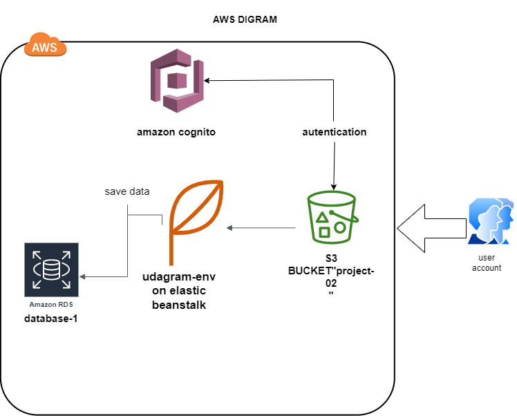

# udagram infrastructure

### AWS RDS Postgres
The application uses RDS Postgres for storing and retrieving information.

Database endpoint: `database-1.cgyni38hwtj0.us-east-1.rds.amazonaws.com`

#### Elastic Beanstalk
The application is build, archived and uploaded to S3 bucket from where Elastic Beanstalk extracts and runs the application on an endpoint.

EB URL: `http://udagram-env.eba-32tqzutu.us-east-1.elasticbeanstalk.com`

#### S3 Bucket
The bundled assets are uploaded to an S3 bucket and that bucket is made publicly readable.

Bucket URL: `http://project-02.s3-website-us-east-1.amazonaws.com`
